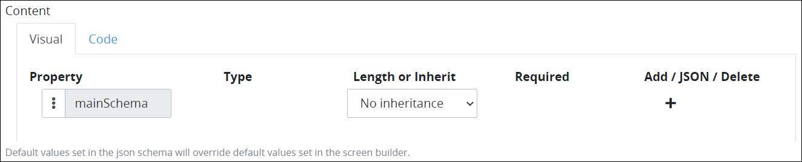
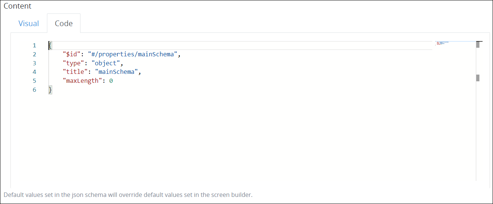

# Edit a Vocabulary

## Edit a ProcessMaker Vocabulary


### ProcessMaker Package Required

The [Vocabularies package](../../../package-development-distribution/package-a-connector/vocabularies.md) must be installed in your ProcessMaker instance. The [Vocabularies](../what-is-a-vocabulary.md) package is not available in the ProcessMaker open-source edition. Contact [ProcessMaker Sales](https://www.processmaker.com/contact/) or ask your ProcessMaker sales representative how the Vocabularies [package](../../../package-development-distribution/first-topic.md) can be installed in your ProcessMaker instance.

### Permissions Required

Your ProcessMaker user account or group membership must have the following permissions to edit a ProcessMaker Vocabulary unless your user account has the **Make this user a Super Admin** setting selected:

* Vocabularies: Edit Vocabularies
* Vocabularies: View Vocabularies

See the ProcessMaker [Vocabularies](../../../processmaker-administration/permission-descriptions-for-users-and-groups.md#vocabularies) permissions or ask your ProcessMaker Administrator for assistance.

### Learn How to Design JSON Schemas

Need to learn how to design JSON schemas? Start with [JSON Schema](https://json-schema.org/). Need to learn how to convert valid JSON to a JSON schema? Use the [JSON Schema Tool](https://jsonschema.net), though do not use JSON intended for production on this free GitHub application.


Follow these steps to edit a ProcessMaker [Vocabulary](../what-is-a-vocabulary.md):

1. [View your ProcessMaker Vocabularies](view-all-vocabularies.md#view-all-vocabularies). The **Vocabularies** page displays.
2. Do one of the following:

   * [Create a new ProcessMaker Vocabulary](create-a-new-vocabulary.md).
   * Click the **Edit** iconfor your ProcessMaker Vocabulary.

   The **Edit** page displays.  
    

3. Edit the following information about the ProcessMaker Vocabulary as necessary:
   * In the **Title** field, edit the ProcessMaker Vocabulary name. This is a required field.
   * In the **Description** field, edit the description of the ProcessMaker Vocabulary. This is a required field.
4. In the **Content** section, edit the JSON schema following one or both of these guidelines:

   * [Visually edit a ProcessMaker Vocabulary](edit-a-vocabulary.md#visually-edit-a-processmaker-vocabulary) using a graphical interface that non-developers may find easier to design a Vocabulary.
   * [Code a ProcessMaker Vocabulary](edit-a-vocabulary.md#code-a-processmaker-vocabulary).

   Changes made to the visual editor reflect in the coded JSON schema and vice versa.

5. Click **Save**.

### Visually Design a ProcessMaker Vocabulary

Design a ProcessMaker [Vocabulary](../what-is-a-vocabulary.md) from the **Visual** tab in the **Content** section of a ProcessMaker Vocabulary if you are not familiar with coding a JSON schema but understand the design compliance your ProcessMaker assets must meet.

Changes to the ProcessMaker Vocabulary in the **Visual** tab reflect in the [**Code** tab](edit-a-vocabulary.md#code-a-processmaker-vocabulary), and vice versa.

Follow these steps to visually edit a ProcessMaker Vocabulary:

1. [Edit a ProcessMaker Vocabulary](edit-a-vocabulary.md#edit-a-processmaker-vocabulary).
2. Locate the **Content** section of the ProcessMaker Vocabulary below the **Description** setting. The **Visual** tab displays by default.  
3. Each ProcessMaker Vocabulary is a JSON object named `mainSchema` that contains the JSON schema, as noted in the **Property** column. If this ProcessMaker Vocabulary contains the same JSON schema properties as an existing Vocabulary in this ProcessMaker instance, select it from the **Length or Inherit** column setting. The default setting for the **Length or Inherit** column is **No inheritance**, meaning this ProcessMaker Vocabulary does not conform to another Vocabulary.
4. Follow these guidelines to add a property to this ProcessMaker Vocabulary if this Vocabulary is not inherit to another Vocabulary:
   1. 
5. 
### Code a ProcessMaker Vocabulary

Code a ProcessMaker Vocabulary from the **Code** tab in the **Content** section of a ProcessMaker Vocabulary.

Changes to the ProcessMaker Vocabulary in the **Code** tab reflect in the [**Visual** tab](edit-a-vocabulary.md#visually-design-a-processmaker-vocabulary), and vice versa.

Follow these steps to code a ProcessMaker Vocabulary:

1. [Edit a ProcessMaker Vocabulary](edit-a-vocabulary.md#edit-a-processmaker-vocabulary).
2. Locate the **Content** section of the ProcessMaker Vocabulary below the **Description** setting, and then select the **Code** tab.  
3. 
## Related Topics















