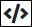

# Edit a Vocabulary

## Edit a ProcessMaker Vocabulary


### ProcessMaker Package Required

The [Vocabularies package](../../../package-development-distribution/package-a-connector/vocabularies.md) must be installed in your ProcessMaker instance. The [Vocabularies](../what-is-a-vocabulary.md) package is not available in the ProcessMaker open-source edition. Contact [ProcessMaker Sales](https://www.processmaker.com/contact/) or ask your ProcessMaker sales representative how the Vocabularies [package](../../../package-development-distribution/first-topic.md) can be installed in your ProcessMaker instance.

### Permissions Required

Your ProcessMaker user account or group membership must have the following permissions to edit a ProcessMaker Vocabulary unless your user account has the **Make this user a Super Admin** setting selected:

* Vocabularies: Edit Vocabularies
* Vocabularies: View Vocabularies

See the ProcessMaker [Vocabularies](../../../processmaker-administration/permission-descriptions-for-users-and-groups.md#vocabularies) permissions or ask your ProcessMaker Administrator for assistance.

### Learn How to Design JSON Schemas

Need to learn how to design JSON schemas? Start with [JSON Schema](https://json-schema.org/). Need to learn how to convert valid JSON to a JSON schema? Use the [JSON Schema Tool](https://jsonschema.net), though do not use JSON intended for production on this free GitHub application.


Follow these steps to edit a ProcessMaker [Vocabulary](../what-is-a-vocabulary.md):

1. [View your ProcessMaker Vocabularies](view-all-vocabularies.md#view-all-vocabularies). The **Vocabularies** page displays.
2. Do one of the following:

   * [Create a new ProcessMaker Vocabulary](create-a-new-vocabulary.md).
   * Click the **Edit** iconfor your ProcessMaker Vocabulary.

   The **Edit** page displays.  
    

3. Edit the following information about the ProcessMaker Vocabulary as necessary:
   * In the **Title** field, edit the ProcessMaker Vocabulary name. This is a required field.
   * In the **Description** field, edit the description of the ProcessMaker Vocabulary. This is a required field.
4. In the **Content** section, edit the JSON schema following one or both of these methods:

   * [Visually edit a ProcessMaker Vocabulary](edit-a-vocabulary.md#visually-edit-a-processmaker-vocabulary) using a graphical interface that non-developers may find easier to design a Vocabulary.
   * [Code a ProcessMaker Vocabulary](edit-a-vocabulary.md#code-a-processmaker-vocabulary).

   Changes made to the visual editor reflect in the coded JSON schema and vice versa.

5. Click **Save**.

### Visually Design a ProcessMaker Vocabulary

Design a ProcessMaker [Vocabulary](../what-is-a-vocabulary.md) from the **Visual** tab in the **Content** section of a ProcessMaker Vocabulary if you are not familiar with coding a JSON schema but understand the design compliance your ProcessMaker assets must meet.

Changes to the ProcessMaker Vocabulary in the **Visual** tab reflect in the [**Code** tab](edit-a-vocabulary.md#code-a-processmaker-vocabulary), and vice versa.

Prior to editing the content of a ProcessMaker Vocabulary, review the [guidelines and best practices in Vocabulary design](../what-is-a-vocabulary.md#guidelines-and-best-practices-in-processmaker-vocabulary-design).

Follow these steps to visually edit a ProcessMaker Vocabulary:

1. [Edit a ProcessMaker Vocabulary](edit-a-vocabulary.md#edit-a-processmaker-vocabulary).
2. Locate the **Content** section of the ProcessMaker Vocabulary below the **Description** setting. The **Visual** tab displays by default.  
3. Select from the **Length or Inherit** column whether this ProcessMaker Vocabulary inherits its properties, at least in part, from another Vocabulary in this ProcessMaker instance. If no other ProcessMaker Vocabularies are in this ProcesMaker instance, only the **No inheritance** option is available. Note that unless a JSON schema was uploaded when this ProcessMaker Vocabulary was created, its root name is `mainSchema`. The JSON schema root contains the JSON schema properties as noted in the **Property** column. The default setting for the **Length or Inherit** column is **No inheritance**, meaning this ProcessMaker Vocabulary does not reference properties from another Vocabulary.
4. Follow these guidelines to add a property to this ProcessMaker Vocabulary regardless of whether this ProcessMaker Vocabulary inherits the properties from another Vocabulary:
   1. Click the **+** icon. A new property embeds to the JSON schema root and below any existing schema properties.
   2. Rename this property by clicking inside the property name below the **Property** column.
   3. Select which data type this property requires by selecting it below the **Type** column for this property. Specifying a data type for this property is not required; however, if a data type is not selected, then validation for that property's value does not occur. A JSON schema property may use one of the following data types:

      * Text \(`String` data type\)
      * Integer
      * Decimal \(Request data stores as a `Floating Point` data type\)
      * Boolean
      * Date \(Request data stores as a `String` data type\)
      * Datetime \(Request data stores as a `String` data type\)
      * Array
      * Object

      See [JSON Data Types](../../../json-the-foundation-of-request-data/what-is-json.md#json-data-types) for examples of each data type.

   4. Indicate if this property requires a value by selecting the checkbox below the **Required** column for that property.
5. Do any of the following as necessary:
   * Click the **View Property as Schema** iconto view the JSON schema property as code.
   * Click the **Delete Property** iconto delete a property.
   * Select the **Code** tab to view your entire JSON schema.

### Code a ProcessMaker Vocabulary

Code a ProcessMaker Vocabulary from the **Code** tab in the **Content** section of a ProcessMaker Vocabulary.

Changes to the ProcessMaker Vocabulary in the **Code** tab reflect in the [**Visual** tab](edit-a-vocabulary.md#visually-design-a-processmaker-vocabulary), and vice versa.

Prior to editing the content of a ProcessMaker Vocabulary, review the [guidelines and best practices in Vocabulary design](../what-is-a-vocabulary.md#guidelines-and-best-practices-in-processmaker-vocabulary-design).

Follow these steps to code a ProcessMaker Vocabulary:

1. [Edit a ProcessMaker Vocabulary](edit-a-vocabulary.md#edit-a-processmaker-vocabulary).
2. Locate the **Content** section of the ProcessMaker Vocabulary below the **Description** setting, and then select the **Code** tab.  
3. Edit your JSON schema. Optionally, select the **Visual** tab to view your entire JSON schema in the graphical interface.

## Related Topics















