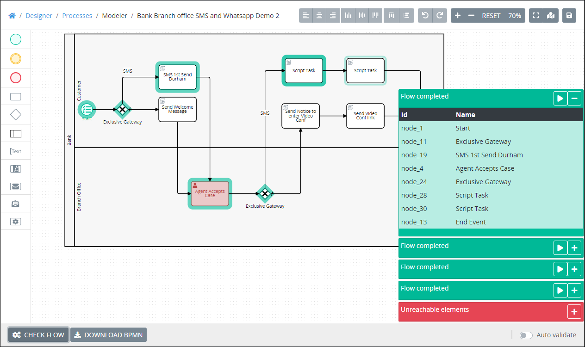

# Process Optimization Package

## Overview


The Process Optimization [package](../first-topic.md) is not available in the ProcessMaker open-source edition. Contact [ProcessMaker Sales](https://www.processmaker.com/contact/) or ask your ProcessMaker sales representative how the Process Optimization package can be installed in your ProcessMaker instance.


The Process Optimization package integrates into Process Modeler to visually validate the workflow in your [Process](../../designing-processes/viewing-processes/what-is-a-process.md) model. Use visual validation to validate if workflow can potentially complete routing through all elements and/or [connectors](../../designing-processes/process-design/model-processes-using-connectors/what-is-a-connector.md) in your Process model. The Process Optimization package extends basic [BPMN 2.0 validation](../../designing-processes/process-design/validate-bpmn-2.0-compliance.md) to validate whether all workflows routes are viable, including connectors that do not apply to BPMN 2.0 validation.

The Process Optimization package has the following features:

* Click the **Check Flow** button in the bottom bar of Process Modeler to automatically view how workflow routes in your Process model. Process Modeler evaluates workflow throughout your Process model, and then displays each possible workflow route results in separate sections. Process Modeler evaluates workflow based on the default [Sequence Flow](../../designing-processes/process-design/model-your-process/process-modeling-element-descriptions.md#sequence-flow) elements and/or conditions set to those Sequence Flow elements throughout the Process model.
* [Tasks](../../using-processmaker/task-management/what-is-a-task.md) need not be assigned to ProcessMaker [users](../../processmaker-administration/add-users/what-is-a-user.md)/[groups](../../processmaker-administration/assign-groups-to-users/what-is-a-group.md) nor Sequence Flow elements configured with routing conditions.

See [Optimize Your Process](../../designing-processes/process-design/optimize-your-process.md).

## Related Topics















