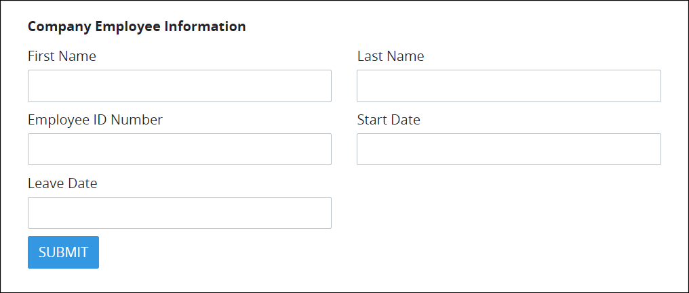
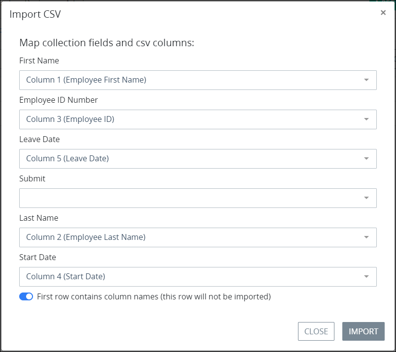
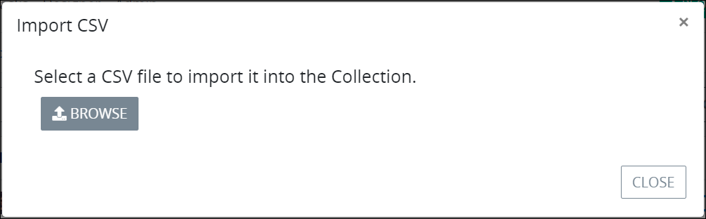
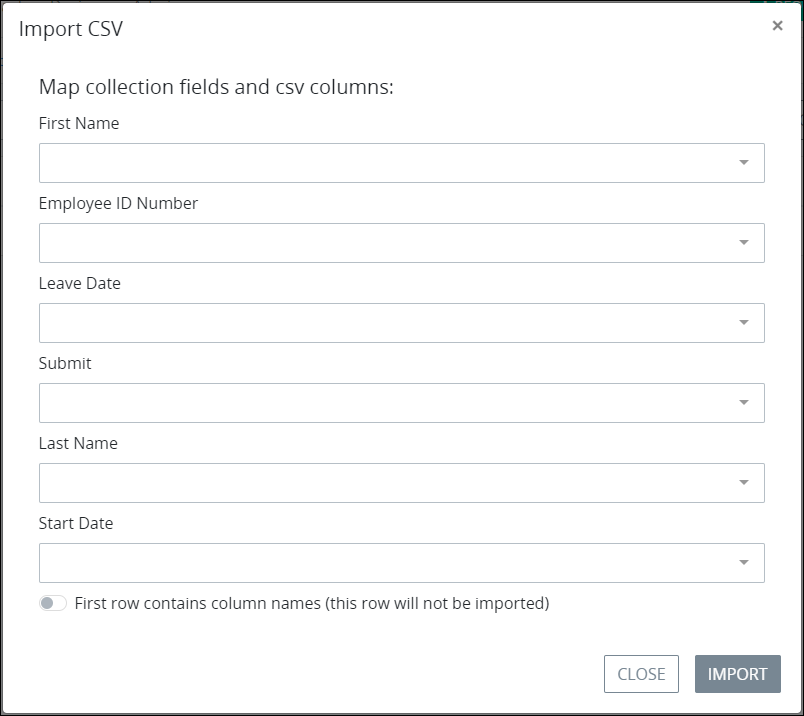

# Import a CSV File to Create Multiple Collection Records

## Overview

Create multiple ProcessMaker Collection records simultaneously by importing a Comma-Separated Values \(CSV\) file into its Collection. A CSV file is a plain-text file that contains data records in tabular format by separating the content of each item in each data record with a comma \(`,`\): the first data record represents the fields, or columns, of the data set while each following data record contains the same number of items in each record as separated by commas.

Map the relationship between which CSV column corresponds with which ProcessMaker Screen control that your Collection uses to create records in that Collection, thereby indicating which Screen control contains which column's value for each data record after importing the CSV file.

Each field in the CSV file does not need to map to a ProcessMaker Screen control; controls that are not mapped to a CSV field contain no values after the CSV file is imported. Inversely, CSV fields that are not mapped to a ProcessMaker Screen control are ignored when the CSV file is imported.

The ProcessMaker Collection creates one record for each data record in the imported CSV file.

## CSV File Import Example

Consider importing the following CSV file into a ProcessMaker Collection to simultaneously create multiple records in that Collection. This example uses a CSV file that contains all company employee names, employee IDs, start date, and leave date if applicable.

```text
Employee First Name,Employee Last Name,Employee ID,Start Date,Leave Date
Louis,Canera,0001,1996-03-14,null
Jane,Lowell,0002,1996-07-01,2000-04-05
Bill,Frizzel,0003,1998-09-15,null
```

The ProcessMaker Collection uses the following Screen to create new records in that Collection.



The data records in the CSV file map to the ProcessMaker Screen controls as follows.

| Source CSV File Column | ProcessMaker Screen Control Label |
| :--- | :--- |
| Employee First Name | First Name |
| Employee Last Name | Last Name |
| Employee ID | Employee ID Number |
| Start Date | Start Date |
| Leave Date | Leave Date |

The image below indicates how the CSV file maps to the ProcessMaker Screen control labels. Note that the **First row contains column names \(this row will not be imported\)** toggle key is enabled so that the first row in the CSV file that indicates the columns in this file.



## Create Multiple ProcessMaker Collection Records from a CSV File


### ProcessMaker Package Required

The [Collections package](../../../package-development-distribution/package-a-connector/collections.md) must be installed in your ProcessMaker instance. The [Collections](../what-is-a-collection.md) package is not available in the ProcessMaker open-source edition. Contact [ProcessMaker Sales](https://www.processmaker.com/contact/) or ask your ProcessMaker sales representative how the Collections package can be installed in your ProcessMaker instance.

### Permissions Required

Your ProcessMaker user account or group membership must have the "Collections: View Collections" permission to view the list of ProcessMaker Collections unless your user account has the **Make this user a Super Admin** setting selected. See the ProcessMaker [Collections](../../permission-descriptions-for-users-and-groups.md#collections) permissions or ask your ProcessMaker Administrator for assistance.

Furthermore, your ProcessMaker user account or group membership must have the following [record permissions](../manage-collections/configure-a-collection.md#configure-record-permissions-for-processmaker-users) from a Collection's configuration that control how records in that Collection are accessed:

* View
* Create

See [Configure a Collection](../manage-collections/configure-a-collection.md#configure-a-processmaker-collection) or ask the manager of that ProcessMaker Collection for assistance.


Follow these steps to create multiple ProcessMaker Collection records at once from a CSV file:

1. [View the records for the ProcessMaker Collection](view-all-records-in-a-collection.md#view-all-records-in-a-collection) in which you want to add records.
2. Click the **+Import CSV** button. The **Import CSV** screen displays.  
3. Click the **Browse** button, and then locate and open the CSV file to import. The **Import CSV** screen displays the controls in the ProcessMaker Screen this Collection uses to create records in this Collection. Below is a ProcessMaker Screen used in [this example](create-multiple-collection-records-from-a-csv-file.md#csv-file-import-example).  
4. Map from which CSV column, or field, the value of each item in each data record in the CSV file corresponds with which ProcessMaker Screen control by selecting that control and then selecting the CSV column. If the CSV file does not contain column/field names, then remember which sequential item in the comma-separated values corresponds with items in each data record that control receives data when the CSV file imports.
5. Enable the **First row contains column names \(this row will not be imported\)** toggle key if the first column/field contains the column names for the CSV file to not import that row. This toggle key is disabled by default.
6. Click the **Import** button. The following message displays if the the CSV file imports correctly: **CSV imported into collection successfully**.

## Related Topics


