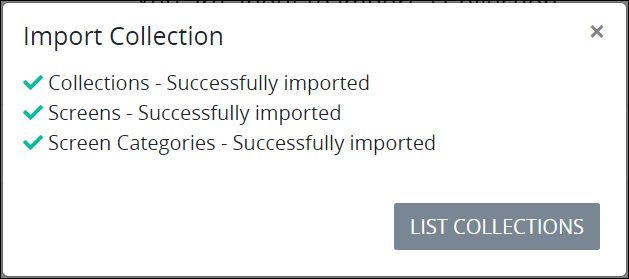
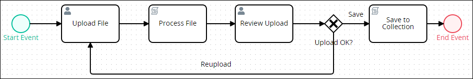
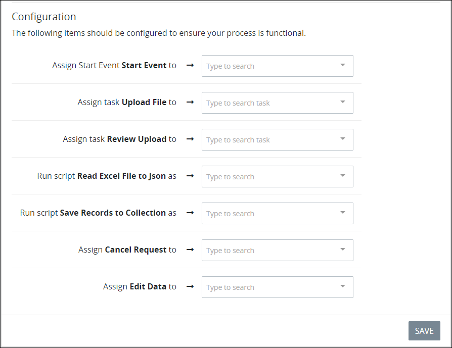
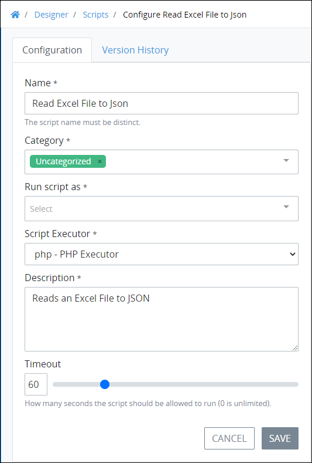

# Example Script Executor Use Case

## Overview

This example demonstrates how to migrate records in a Microsoft Excel spreadsheet to an existing [ProcessMaker Collection](../../processmaker-collections/what-is-a-collection.md). In this example, the ProcessMaker Collection stores information about each company employee, such as each employee's first and last name, hire date, salary, and how many vacation days used. These employee records already exist in an Excel spreadsheet, but must be migrated to the ProcessMaker Collection to save time and prevent human error. The ProcessMaker Collection must already exist with its ProcessMaker Screens that correspond with the fields in the Excel spreadsheet records. 

This example uses the following ProcessMaker assets:

* **Process:** This example uses a [Process](../../../designing-processes/viewing-processes/what-is-a-process.md) named "Excel Spreadsheet Records to Collection Records Example," which may be downloaded for this example and then [imported into your ProcessMaker instance](../../../designing-processes/viewing-processes/view-the-list-of-processes/import-a-bpmn-compliant-process.md). Except for the [ProcessMaker Script Executor](../what-is-a-script-executor.md) and Collection, the remaining ProcessMaker assets in this example import with the Process and are already referenced in appropriate Process model nodes. This Process manages the migration process as summarized below:
  * A specified [Request](../../../using-processmaker/requests/what-is-a-request.md) participant uploads the Excel file from which to migrate its records to the ProcessMaker Collection.
  * A [ProcessMaker Script](../../../designing-processes/scripts/what-is-a-script.md) reads the Excel file records and stores them in that Request's JSON data model.
  * A specified Request participant reviews the migrated Excel file records.
  * If that Request participant indicates that the Excel file records read correctly, save those records to an existing ProcessMaker Collection; otherwise, workflow returns to the same Request participant who uploaded the Excel file to do so again.
* **ProcessMaker Script Executor:** This example uses a custom ProcessMaker Script Executor based on the default PHP Script Executor, but requires the [PHPSpreadsheet package](https://github.com/PHPOffice/PhpSpreadsheet). The PHPSpreadsheet package is an open-source PHP library that reads and writes spreadsheet files. Note that after creating this ProcessMaker Script Executor, it may be used for any ProcessMaker Script in your ProcessMaker instance that uses PHP and requires the PHPSpreadsheet package.
* **ProcessMaker Scripts:** This example uses the following ProcessMaker Scripts:
  * **Read Excel File to JSON:** This ProcessMaker Script reads the records from the Excel file, then stores the Excel spreadsheet records in that Request's JSON data model. This ProcessMaker Script runs from the custom PHP ProcessMaker Script Executor to read the records from the Excel spreadsheet. By default, this ProcessMaker Script stores the Excel spreadsheet records in a [Request variable](../../../json-the-foundation-of-request-data/what-is-a-request-variable.md) named `persons`.
  * **Save Records to Collection:** This ProcessMaker Script writes the records stored in the Request variable `persons` to the ProcessMaker Collection.
* **ProcessMaker Screens:** This example uses the following [ProcessMaker Screens](../../../designing-processes/design-forms/what-is-a-form.md):

  * **Upload Person Records:** This ProcessMaker Screen allows a specified Request participant to upload the Excel file from which to migrate its records.
  * **Review Uploaded Person Records:** This ProcessMaker Screen allows a specified Request participant to review the migrated Excel file records and then indicate if those records migrated correctly.

  The ProcessMaker Collection uses its own ProcessMaker Screens which are not relevant to how this example functions.

* **ProcessMaker Collection:** This example uses an existing ProcessMaker Collection to save the read spreadsheet records that the Save Records to Collection Script writes to create the Collection records. This ProcessMaker Collection contains 18 records already to demonstrate the content of each record and how fields in the Excel spreadsheet must correspond with the Collection content. Note that the [Collections package](../../../package-development-distribution/package-a-connector/collections.md) must be installed in your ProcessMaker instance. The Collections [package](../../../package-development-distribution/first-topic.md) is not available in the ProcessMaker open-source edition. Contact [ProcessMaker Sales](https://www.processmaker.com/contact/) or ask your ProcessMaker sales representative how the Collections package can be installed in your ProcessMaker instance.

Click the video below to watch a demonstration of this example.

This example contains the following procedures in this order:

1. **Import the ProcessMaker Collection:** Since the purpose of this example is to demonstrate how to use a custom ProcessMaker Script Executor, this example provides the ProcessMaker Collection that the example uses. See [Import the ProcessMaker Collection](example-script-executor-use-case.md#import-the-processmaker-collection).
2. **Import the Process:** Import the Process that this example uses. The Process contains the two ProcessMaker Scripts and Screens this example uses. See [Import the Process](example-script-executor-use-case.md#import-the-process).
3. **Create the custom ProcessMaker Script Executor:** Create the ProcessMaker Script Executor that builds the PHPSpreadsheet package into its Docker container. See [Create the Custom ProcessMaker Script Executor](example-script-executor-use-case.md#create-the-custom-processmaker-script-executor).
4. **Configure the ProcessMaker Script that reads the Excel file:** Configure the ProcessMaker Script named "Read Excel File to JSON" to run using the custom Script Executor. See [Configure the ProcessMaker Script That Reads the Excel File](example-script-executor-use-case.md#configure-the-processmaker-script-that-reads-the-excel-file).
5. **Download the Excel file:** Download the Excel file that contains sample records to be migrated to the ProcessMaker Collection. See [Download the Excel File](example-script-executor-use-case.md#download-the-excel-file).
6. **Start a Request:** Start a Request for the Process this example uses. See [Start a Request for the Example Process](example-script-executor-use-case.md#start-a-request-for-the-example-process).

## Import the ProcessMaker Collection


### ProcessMaker Package Required

The [Collections package](../../../package-development-distribution/package-a-connector/collections.md) must be installed in your ProcessMaker instance. The [Collections](../../processmaker-collections/what-is-a-collection.md) package is not available in the ProcessMaker open-source edition. Contact [ProcessMaker Sales](https://www.processmaker.com/contact/) or ask your ProcessMaker sales representative how the Collections package can be installed in your ProcessMaker instance.

### Permission Required

Your ProcessMaker user account or group membership must have the "Collections: View Collections" permission to view the list of ProcessMaker Collections unless your user account has the **Make this user a Super Admin** setting selected. This permission is different than [record permissions](../../processmaker-collections/manage-collections/configure-a-collection.md#configure-record-level-permissions-for-users) in a ProcessMaker Collection that allow you to view the records in that Collection.

See the ProcessMaker [Collections](../../permission-descriptions-for-users-and-groups.md#collections) permissions or ask your ProcessMaker Administrator for assistance.


Prior to importing the ProcessMaker Collection into your ProcessMaker instance, download the Collection this example uses named `people.json`:



Follow these steps to import the ProcessMaker Collection as [described in this example](example-script-executor-use-case.md#overview):

1. [View your ProcessMaker Collections](../../processmaker-collections/manage-collections/view-collections.md#view-all-collections). The **Collections** page displays.
2. Click the **Import** button. The **Import Collection** screen displays.  
3. Click **Browse** to locate the ProcessMaker Collection you downloaded named `people.json`.
4. Click **Import**. The **Import Collection** screen displays to indicate that the ProcessMaker Collection imported correctly.  
5. Click **List Collections**. The **Collections** page displays.
6. [View the records for the ProcessMaker Collection](../../processmaker-collections/manage-records-in-a-collection/view-all-records-in-a-collection.md#view-all-records-in-a-collection) named People that this example uses.
7. [View a record](../../processmaker-collections/manage-records-in-a-collection/view-a-collection-record.md) in this ProcessMaker Collection to see an example of the information to be migrated from the Excel spreadsheet.

## Import the Process


Your ProcessMaker user account or group membership must have the following permissions to import a ProcessMaker version 4 Process unless your user account has the **Make this user a Super Admin** setting selected:

* Processes: Import Processes
* Processes: View Processes

See the ProcessMaker [Processes](../../permission-descriptions-for-users-and-groups.md#processes) permissions or ask your ProcessMaker Administrator for assistance.


Prior to importing the Process into your ProcessMaker instance, download the Process model this example uses named `Process - Excel Spreadsheet Records to Collection Records Example.json`:



Below is the Process model after the Process [described in this example](../../../designing-processes/data-connector-management/data-connector-example.md#overview) is imported and edited in Process Modeler.

Follow these steps to import the Process:

1. [View your active Processes.](../../../designing-processes/viewing-processes/view-the-list-of-processes/#view-your-processes) The **Processes** tab displays.
2. Click the **Import** button. The following message displays: **You are about to import a Process. After importing, you can reassign users and groups to your process.**

   

3. Click **Browse** to locate the Process model you downloaded named `Process - Excel Spreadsheet Records to Collection Records Example.json`.
4. Click **Import**. The **Import Process** screen displays.
5. From the **Import Process** screen, locate the **Configuration** section below the **Status** section.  
6. From the **Configuration** section, assign the Request participants and ProcessMaker user accounts for this example. Follow these guidelines:
   * **Assign the** [**Start Event**](../../../designing-processes/process-design/model-your-process/process-modeling-element-descriptions.md#start-event) **element named "Start Event" to the ProcessMaker user and/or group**

     Assign which ProcessMaker user and/or group can start a Request of your imported Process. Type into the **Assign Start Event** setting to filter ProcessMaker users and/or groups that display in that setting's drop-down menu. If you will start a Request for this example, then assign the Start Event element to your ProcessMaker user.

   * **Assign the** [**Form Task**](../../../designing-processes/process-design/model-your-process/process-modeling-element-descriptions.md#form-task) **element named "Upload File" to the ProcessMaker user and/or group**

     Assign which ProcessMaker user and/or group uploads the Excel file to the Process from which its records migrate to the ProcessMaker Collection. Type into its **Assign Task** setting to filter ProcessMaker users and/or groups that display in that setting's drop-down menu. Optionally, use the **Requester** option to assign that Task to the ProcessMaker user that started that Request.

   * **Assign the Form Task element named "Review Upload" to the ProcessMaker user and/or group**

     Assign which ProcessMaker user and/or group reviews the records after they have been read from the Excel file. Type into its **Assign Task** setting to filter ProcessMaker users and/or groups that display in that setting's drop-down menu. Optionally, use the **Previous Task Assignee** option to assign the Task to the assignee of the "Upload File" Form Task.

   * **Select which ProcessMaker user to run the "Read Excel File to JSON" Script**

     Select which ProcessMaker user account to run the "Read Excel File to JSON" Script, which is the  Script that reads the Excel spreadsheet records and stores them to that Request's JSON data model. This ProcessMaker Script runs when the `Process File` Script Task element triggers. Type into its **Run script** setting to filter ProcessMaker users and/or groups that display in that setting's drop-down menu. Ensure that the selected ProcessMaker user or group members have appropriate ProcessMaker permissions to run Scripts.

   * **Select which ProcessMaker user to run the "Save Records to Collection" Script**

     Select which ProcessMaker user account to run the "Save Records to Collection" Script, which is the Script that writes the records stored in that Request's JSON data model to the ProcessMaker Collection. This ProcessMaker Script runs when the `Save to Collection` Script Task element triggers. Type into its **Run script** setting to filter ProcessMaker users and/or groups that display in that setting's drop-down menu. Ensure that the selected ProcessMaker user or group members have appropriate ProcessMaker permissions to run Scripts.

   * **Assign which ProcessMaker user and/or group can cancel Requests**

     Assign which ProcessMaker user and/or group can [cancel Requests](../../../using-processmaker/requests/delete-a-request.md) for your imported Process. If no user or group are selected, no one can cancel a Request from this Process. Type into the **Assign Cancel Request** setting to filter ProcessMaker users and/or groups that display in that setting's drop-down menu.

   * **Assign which ProcessMaker user and/or group can edit Request data**

     Assign which ProcessMaker user or group has permission to [edit Request data](../../../using-processmaker/requests/request-details/summary-for-completed-requests.md#editable-request-data) from this Process. By editing Request data, these users and group members can adjust the data that Request participants have submitted during a Request. If no user or group are selected, no one can edit Request data from this Process. Type into the **Assign Edit Data** setting to filter ProcessMaker users and/or groups that display in that setting's drop-down menu.
7. Click **Save**. The **Processes** page displays the imported Process.

## Create the Custom ProcessMaker Script Executor

Follow these steps to create the custom ProcessMaker Script Executor as [described in this example](example-script-executor-use-case.md#overview):

1. [View your ProcessMaker Script Executors](view-script-executors.md#view-all-processmaker-script-executors). The **Script Executors** page displays.
2. Click the **+Script Executor** button. The **Add New Script Executor**
    screen displays.  
3. In the **Name** setting, enter the unique name for the ProcessMaker Script Executor. This name displays from ProcessMaker Script configuration settings, so enter a descriptive name that ProcessMaker designers configuring their ProcessMaker Scripts understand what customization this Script Executor provides. This example uses the name `PHP with PHPSpreadsheet package`.
4. In the **Description** setting, enter a description for the ProcessMaker Script Executor.
5. From the **Language** setting, select the **PHP** option. The default [Dockerfile](https://docs.docker.com/engine/reference/builder/#:~:text=A%20Dockerfile%20is%20a%20text,can%20use%20in%20a%20Dockerfile%20.) content to run PHP ProcessMaker Scripts displays in the **Dockerfile** setting. The Dockerfile content includes the ProcessMaker SDK for that language.
6. From the **Dockerfile** setting, append the default Dockerfile content with the following commands that contain the dependencies to use the PHPSpreadsheet package and integrate this package into this Docker contain. Ensure not to edit the default Dockerfile content as this is necessary to run ProcessMaker Scripts successfully in this Docker container.

   `RUN apt-get update -y \`

     `&& apt-get install -y \`

        `libpng-dev \`

     `&& apt-get clean -y \`

     `&& docker-php-ext-install gd zip \`

     `&& docker-php-ext-enable gd zip`

   `RUN composer require phpoffice/phpspreadsheet`

7. Click **Save and Build** to build the Docker container from which the ProcessMaker Script Executor runs Scripts. The **Build Command Output** setting displays below the **Dockerfile** setting as the ProcessMaker Script Executor builds the Docker container in real-time. If the Docker container builds successfully, the following message displays: **Executor Successfully Built. You can now close this window**. If building the Docker container is unsuccessful, the following message displays: **Error Building Executor. See Output Above.**. The **Build Command Output** setting displays the Dockerfile error.
8. Click **Close**.

## Configure the ProcessMaker Script That Reads the Excel File


Your ProcessMaker user account or group membership must have the following permissions to configure a ProcessMaker Script unless your user account has the **Make this user a Super Admin** setting selected:

* Scripts: Edit Scripts
* Scripts: View Scripts

See the ProcessMaker [Scripts](../../permission-descriptions-for-users-and-groups.md#scripts) permissions or ask your ProcessMaker Administrator for assistance.


Follow these steps to configure the ProcessMaker Scripts as [described in this example](example-script-executor-use-case.md#overview):

1. [View your ProcessMaker Scripts.](../../../designing-processes/scripts/manage-scripts/view-all-scripts.md#view-all-processmaker-scripts) The **Scripts** page displays.
2. Click the **Configure** iconfor the ProcessMaker Script named `Read Excel File to JSON`. The **Edit Configuration** page displays.  
3. From the **Script Executor** drop-down menu, select the [ProcessMaker Script Executor you created for this example](example-script-executor-use-case.md#create-the-custom-processmaker-script-executor) to run this Script.
4. Click **Save**.

The second ProcessMaker Script this example uses, `Save Records to Collection`, by default configures to use the ProcessMaker Script Executor named `PHP Executor` when it imports into your ProcessMaker instance.

## Download the Excel File

Download the Excel file [that this example](example-script-executor-use-case.md#download-the-excel-file) uses to migrate its records to an existing ProcessMaker Collection.



## Start a Request for the Example Process

The example is ready to demonstrate. To demonstrate this example, start a Request of this Process.

Follow these steps to start a Request of this Process as [described in this example](example-script-executor-use-case.md#overview):

1. [Log on](../../../using-processmaker/log-in.md#log-on) as a ProcessMaker user you configured from the Start Event element that can start Requests for this Process.
2. [Start a Request of this Process](../../../using-processmaker/requests/make-a-request.md#start-a-request). Remember that the Process name is `Excel Spreadsheet Records to Collection Records Example`.
3. Open the **Upload File** Form Task from your [To Do Tasks](../../../using-processmaker/task-management/view-tasks-you-need-to-do.md#view-your-assigned-tasks). After opening the Task, the ProcessMaker Screen to upload the Excel file in the example displays.

